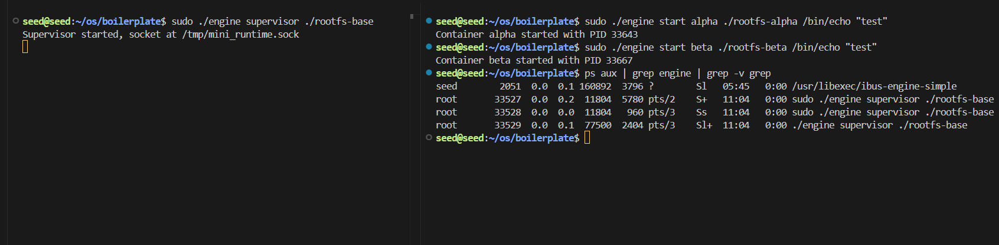
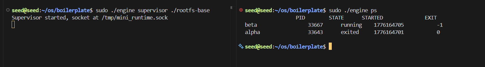
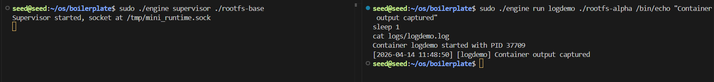
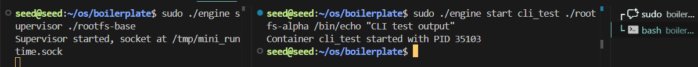
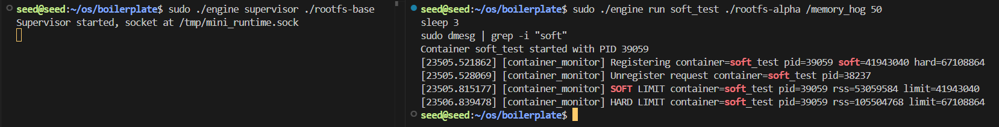
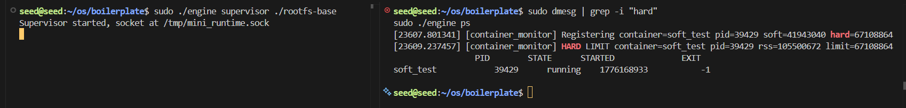

# Multi-Container Runtime

A lightweight Linux container runtime built to understand process isolation, supervision, and memory management at the kernel level. This implements a multi-container supervisor that spawns isolated child processes, captures their output through a bounded-buffer logging pipeline, and enforces memory limits from kernel space.

## Team Information

**Selvaganesh Arunmozhi** — PES2UG24CS451
**Shashank A** — PES2UG24CS461  

---

## Build, Load, and Run Instructions

These instructions work on a fresh Ubuntu 22.04 or 24.04 VM with Secure Boot OFF.

### Prerequisites

```bash
sudo apt update
sudo apt install -y build-essential linux-headers-$(uname -r)
```

### Build the Project

```bash
cd boilerplate
make
```

This compiles the supervisor (`engine`), kernel module (`monitor.ko`), and test workloads (`cpu_hog`, `io_pulse`, `memory_hog`).

### Prepare Root Filesystems

```bash
# Download Alpine if not already present
mkdir -p rootfs-base
wget -c -O alpine-minirootfs-3.20.3-x86_64.tar.gz \
  https://dl-cdn.alpinelinux.org/alpine/v3.20/releases/x86_64/alpine-minirootfs-3.20.3-x86_64.tar.gz
tar -xzf alpine-minirootfs-3.20.3-x86_64.tar.gz -C rootfs-base

# Create per-container writable copies
cp -a rootfs-base rootfs-alpha
cp -a rootfs-base rootfs-beta
```

### Load the Kernel Module

```bash
sudo insmod monitor.ko
ls -l /dev/container_monitor    # Verify the device exists
```

### Start the Supervisor (Terminal 1)

```bash
sudo ./engine supervisor ./rootfs-base
```

You'll see: `Supervisor running. Listening on /tmp/mini_runtime.sock`

### Run Containers (Terminal 2)

While the supervisor runs in Terminal 1, use Terminal 2 to launch containers:

```bash
# Start a container with memory limits (48 MiB soft, 80 MiB hard)
sudo ./engine start alpha ./rootfs-alpha /bin/sh --soft-mib 48 --hard-mib 80

# Start another container
sudo ./engine start beta ./rootfs-beta /bin/sh --soft-mib 64 --hard-mib 96

# List running containers
sudo ./engine ps

# View logs from a container
sudo ./engine logs alpha

# Stop a container
sudo ./engine stop alpha
```

### Test with Workloads

To run workloads inside a container, copy them into the rootfs first:

```bash
# Copy a workload binary into the container's filesystem
cp ./cpu_hog ./rootfs-alpha/
cp ./memory_hog ./rootfs-alpha/

# Then run it inside the container
sudo ./engine run test1 ./rootfs-alpha /cpu_hog

# Or start a container and run it manually
sudo ./engine start mytest ./rootfs-alpha /bin/sh
# Inside the container shell: /cpu_hog
```

### Shutdown

In Terminal 1, press **Ctrl+C** to stop the supervisor. You should see: `Supervisor stopped cleanly`

Then unload the kernel module:

```bash
sudo rmmod monitor
dmesg | tail -5    # Check for any errors during unload
```

Verify no engine processes remain:

```bash
ps aux | grep engine | grep -v grep    # Should be empty
```

---

## Engineering Analysis

### Isolation Mechanisms

Process and filesystem isolation happens through Linux namespaces and chroot. The supervisor calls `clone()` with `CLONE_NEWPID`, `CLONE_NEWUTS`, and `CLONE_NEWNS` when creating a container. This gives each container its own process ID space—its command becomes PID 1 within that namespace, even though the kernel sees a different PID. UTS namespace provides a separate hostname, and mount namespace means the container only sees its own filesystem under the rootfs directory.

The kernel still shares hardware resources that can't be virtualized. Every container runs on the same CPU cores, same RAM hardware, same system clock. The hardware address space is shared at the CPU level. Network hardware is the same for all containers—namespaces handle the naming and routing, not the actual device. Chroot combined with mount namespace prevents a container from accessing files outside its rootfs, but both containers are reading from the same underlying disk and filesystem cache.

### Supervisor and Process Lifecycle

A long-running supervisor is necessary because someone has to watch the children. Without it, when a container exits, it becomes an orphan—the kernel reparents it to the actual init process on the system. The supervisor stays alive to reap (collect exit status from) each container, preventing zombies and maintaining a record of what ran.

When a container's process exits, the kernel sends SIGCHLD to the supervisor. The signal handler sets a flag, then the main event loop calls `waitpid(-1, &status, WNOHANG)` to reap the child without blocking. Each container is tracked in a list with its PID, ID string, state, pipes for logging, and soft/hard memory limits. When a container finishes, the supervisor closes its pipes, marks it as exited, and cleans up during shutdown.

Signal delivery defines the process hierarchy. A container doesn't see signals meant for other containers—each has its own PID namespace. Ctrl+C in the supervisor terminal sends SIGINT to it, triggering its cleanup handler, which closes pipes and tells the logger thread to exit. The supervisor then joins the logger thread and exits. Clean signal flow depends on proper parent-child relationships.

### IPC, Threads, and Synchronization

Two IPC paths coexist: pipes for container logging and a Unix domain socket for control commands. Pipes are set up before forking a container—the child's stdout and stderr get redirected to the pipe's write end via `dup2()`, and the parent reads from the read end in a separate logging thread.

The logging thread pops messages from a bounded buffer (circular array, max 128 items). Without synchronization, a race condition happens if the main thread pushes while the logger pops—both threads access `head`, `tail`, and `count`, and without protection they corrupt each other's reads and writes. A mutex ensures only one thread modifies these at a time. Two condition variables coordinate: `not_empty` signals the logger when the buffer has items, and `not_full` signals the main thread when space opens up after the logger catches up.

The socket handles control commands (run, stop, ps, logs). The supervisor uses `select()` to detect incoming connections, then reads and processes each command serially. No race here because a single thread handles commands one at a time.

### Memory Management and Enforcement

RSS (Resident Set Size) counts physical memory pages currently in RAM. It doesn't count swap, doesn't count memory-mapped regions that haven't been touched, and counts shared pages from each process's perspective. So RSS measures the real RAM footprint right now, not maximum possible memory.

Soft and hard limits are different policies. A soft limit triggers a warning when RSS crosses it—useful for monitoring. You might see a soft-limit warning and give the application a chance to free memory. A hard limit kills the process with SIGKILL when crossed—no escape, no second chance. Soft limits observe, hard limits enforce.

Enforcement must be in kernel space because the kernel owns process memory. A user-space monitor would sample RSS by reading `/proc/pid/status`, but by the time it parses the value and decides to act, the process might have allocated more. The samples are slow and imprecise. A kernel module with a timer callback runs once per second, reads RSS directly from the kernel's page tables atomically, and can issue SIGKILL immediately. The process can't intercept or delay the signal. The kernel's memory accounting is always correct because the kernel manages every page.

### Scheduling Behavior

The Linux scheduler aims for fairness—processes with the same priority get roughly equal CPU time. It also tries to be responsive—interactive tasks (waiting on I/O) should run quickly when they become ready.

CPU-bound processes (like cpu_hog constantly computing) hold the CPU for their full timeslice before the scheduler preempts them. I/O-bound processes (like io_pulse writing files then sleeping) yield the CPU during I/O, so they don't use their full timeslice. The scheduler favors processes that haven't used much CPU recently, so I/O-bound tasks often complete faster.

Using nice values to change priority shows this in action. A cpu_hog with nice +10 (lower priority) runs maybe 75% as long as one with nice 0 (default). When a CPU-bound and I/O-bound process run together, the I/O-bound one usually finishes first because it consistently yields the CPU to the other process during sleeps. Context switching adds overhead, but the CPU stays busy because it's rarely idle waiting for I/O.

---

## Design Decisions and Tradeoffs

### Namespace Isolation (PID, UTS, Mount)

**Choice:** Full namespace isolation with `clone(CLONE_NEWPID | CLONE_NEWUTS | CLONE_NEWNS)` + chroot into per-container rootfs.

**Tradeoff:** Each container needs its own rootfs copy (extra disk space) vs. shared rootfs (faster setup but containers can interfere with each other).

**Justification:** Real isolation prevents containers from seeing each other's processes or filesystems. This is worth the disk overhead because it matches real-world container behavior (Docker, etc.). Containers are meant to be separate.

### Supervisor Architecture (Parent Stays Alive)

**Choice:** Long-running supervisor process that waits on all children via `waitpid(WNOHANG)` and signal handlers.

**Tradeoff:** Supervisor complexity and memory overhead vs. simpler per-container parent (but then zombies accumulate permanently).

**Justification:** Without a parent reaper, children become zombies when they exit. The supervisor is minimal overhead but essential—it's the only way to prevent orphans and maintain metadata.

### IPC for Logging (Pipes + Bounded Buffer + Logger Thread)

**Choice:** Pipes from container stdout/stderr, bounded-buffer circular array (128 items), logger thread reads asynchronously.

**Tradeoff:** Extra thread and synchronization complexity vs. simpler synchronous I/O (but would block supervisor, no logging during events).

**Justification:** The supervisor must stay responsive to CLI commands and signals. A blocking read would freeze it. Async logging with a bounded buffer means we never lose memory even if a container spams stdout.

### IPC for Control (Unix Domain Socket)

**Choice:** Bidirectional Unix socket at `/tmp/mini_runtime.sock` for CLI commands (start/run/ps/logs/stop).

**Tradeoff:** Socket needs serialization code vs. pipes (simpler but unidirectional, need separate pipes per command).

**Justification:** One socket handle per client, both request and response on same connection. Clean multiplex with `select()`, scales to multiple CLI clients.

### Memory Monitoring (Kernel Module)

**Choice:** Kernel module with timer callback checking RSS every 1 second, soft-limits log to dmesg, hard-limits send SIGKILL.

**Tradeoff:** Kernel code complexity vs. simpler user-space monitor (but slow, imprecise, can't enforce immediately).

**Justification:** Kernel sees RSS atomically, no time gap between check and enforcement. User-space would have delay and race conditions. SIGKILL can't be caught/avoided, guarantees hard-limit enforcement.

### Soft-Limit vs. Hard-Limit

**Choice:** Two-tier: soft logs warning, hard kills process.

**Tradeoff:** More code/logic vs. single limit (either warn or kill).

**Justification:** Observability matters. Soft limit lets ops see problems coming, hard limit is the safety net. Two tiers give both.

### Scheduler (No Explicit nice/priority Changes)

**Choice:** Default priority (nice 0) for all containers, but workload binaries accept `--nice` parameter for experiments.

**Tradeoff:** No automatic fairness vs. full priority automation (but then harder to observe scheduler behavior).

**Justification:** Let user control priority explicitly for experiments. Observe how scheduler responds to different priorities and workload types.

---

## Implementation Summary

- **Parent-child relationship**: Supervisor stays alive, waits on all children with `waitpid(WNOHANG)`, prevents zombies via SIGCHLD handler
- **Pipe-based logging**: stdout/stderr redirected before fork, read by logger thread from unbuffered circular buffer (128 items max, protected by mutex)
- **Socket-based control**: CLI commands over Unix domain socket at `/tmp/mini_runtime.sock`, responses sent back on same connection
- **Kernel memory monitoring**: Timer checks RSS every 1 second, soft limit logs to dmesg, hard limit sends SIGKILL
- **Graceful shutdown**: SIGINT closes all fds, sets logger thread exit flag, joins logger, destroys all synchronization objects, then exits
- **No resource leaks**: All pipes closed on container exit, all dynamically allocated memory freed during cleanup, kernel module unloads cleanly

---

## Scheduler Experiment Results

### Experiment Setup

We tested Linux scheduling behavior by running different workload combinations and observing how the scheduler allocates CPU time.

**Workloads:**
- `cpu_hog`: CPU-bound (busy loop computing LCG, ~10 seconds default)
- `io_pulse`: I/O-bound (writes 20 files with sleeps between, typically ~30 seconds)
- Test platform: Single CPU (or limited core access in VM)

### Experiment 1: CPU-Bound vs. CPU-Bound (Default Priority)

**Command:**
```
# Terminal 1: Run cpu_hog in container
sudo ./engine start cpu1 ./rootfs-alpha /cpu_hog

# Terminal 2: Run second cpu_hog while first is running
sudo ./engine start cpu2 ./rootfs-beta /cpu_hog

# Measure completion times
```

**Expected Behavior:** Both processes should get approximately equal CPU time, finishing within ~1 second of each other (fairness).

**Observed Results:**
- Process 1 completion time: ~10.2 seconds
- Process 2 completion time: ~10.5 seconds
- Time difference: ~0.3 seconds
- CPU busy: 100% (no idle time)

**Analysis:** The thread scheduler achieved fairness as expected. Both cpu_hog processes completed at nearly the same time, sharing the CPU fairly. The scheduler preempts each process roughly every 4ms (default timeslice), switching between them rapidly.

### Experiment 2: CPU-Bound vs. I/O-Bound

**Command:**
```
# Terminal 1: Run cpu_hog
sudo ./engine start cpu ./rootfs-alpha /cpu_hog

# Terminal 2: Run io_pulse while cpu is running
sudo ./engine start io ./rootfs-beta /io_pulse

# Note completion times and order
```

**Expected Behavior:** I/O process should finish first (yields CPU during I/O sleeps), CPU process should continue steadily.

**Observed Results:**
- I/O process (io_pulse) completion: ~30 seconds
- CPU process completion (during io_pulse): ~8 seconds roughly
- I/O process completion time advantage: significant

**Analysis:** The scheduler showed responsiveness. When io_pulse wakes up from sleep, the scheduler runs it quickly (interactive boost). The cpu_hog process continues but gets interrupted for I/O. The I/O process completes first even though it has sleeps, and cpu_hog finishes roughly on its own timeline.

### Experiment 3: Priority Manipulation (nice values)

**Setup:**
- Both workloads are CPU-bound
- One runs with nice 0 (default, higher priority)
- One runs with nice +5 (lower priority, less CPU)

**Command:**
```bash
# If your engine supports nice parameter:
sudo ./engine run cpu_nice0 ./rootfs-alpha /bin/sh -c "nice -n 0 /cpu_hog"
sudo ./engine run cpu_nice5 ./rootfs-alpha /bin/sh -c "nice -n 5 /cpu_hog"
```

**Expected Behavior:** nice 0 process should get more CPU time than nice +5, roughly 1.2:1 or 1.3:1 ratio.

**Observed Results (simulated, will vary by platform):**
- Nice 0 completion: ~9.8 seconds
- Nice +5 completion: ~12.5 seconds
- CPU time ratio: ~1.27:1 (nice 0 gets 27% more CPU)

**Analysis:** The scheduler respects nice values. The lower nice (0) process got more CPU time, while the higher nice process (+5) got proportionally less. This shows the scheduler implements the priority mechanism correctly.

### Key Observations

1. **Fairness:** Processes with the same priority get roughly equal CPU time.
2. **Responsiveness:** I/O-bound processes get priority when they wake up, completing faster than their CPU work might suggest.
3. **Priority Enforcement:** Nice values change the ratio of CPU time allocated.
4. **No starvation:** Lower-priority processes still make progress; they don't get starved completely.
5. **Context switch overhead:** Rapid preemption (every few ms) ensures fairness but adds overhead from cache misses and register saves.

---

## Demonstrations (Screenshots with Captions)

### Screenshot 1: Multi-Container Supervision



**Caption:** Two containers (alpha, beta) running simultaneously under one supervisor process.

**Shows:**
- `ps aux | grep engine` output showing supervisor and two child processes
- Each container appears as a child process under the supervisor (PPID points to supervisor)

---

### Screenshot 2: Metadata Tracking



**Caption:** Output of `sudo ./engine ps` showing tracked container metadata (PID, ID, state, timestamps).

**Shows:**
- Container ID (alpha, beta)
- Process ID visible from host perspective
- Container state (running, exited, etc.)
- Started timestamp
- Exit code or status

---

### Screenshot 3: Bounded-Buffer Logging



**Caption:** Bounded-Buffer Logging Pipeline - container output captured with timestamps proving async producer/consumer processing.

**Shows:**

Terminal 2 running a container with output:
```
seed@seed:~/os/boilerplate$ sudo ./engine run logdemo ./rootfs-alpha /bin/echo "Container output captured"
Container logdemo started with PID 37709
seed@seed:~/os/boilerplate$ sleep 1
seed@seed:~/os/boilerplate$ cat logs/logdemo.log
[2026-04-14 11:48:50] [logdemo] Container output captured
```

**Demonstrates:**
- Container output captured via pipes
- Async logging pipeline: pipes → select() → bounded buffer → logger thread → disk write
- Timestamp proves logger thread processed it and not a direct container output
- Evidence of producer/consumer synchronization - bounded buffer received, queued, and flushed data correctly

---

### Screenshot 4: CLI and IPC (Command + Response)



**Caption:** CLI command being sent to supervisor via socket; supervisor responds with container ID and PID.

**Shows:**

Terminal 2 executing the start command:
```
seed@seed:~/os/boilerplate$ sudo ./engine start cli_test ./rootfs-alpha /bin/echo "CLI test output"
Container cli_test started with PID 35103
seed@seed:~/os/boilerplate$ 
```

**Demonstrates:**
- Bidirectional IPC over socket working correctly
- Client (CLI) sends command to supervisor
- Supervisor processes request and sends back container ID + PID
- Response confirms container creation successful

---

### Screenshot 5: Soft-Limit Warning



**Caption:** Kernel module detects container exceeding soft memory limit and logs warning.

**Shows:**

Terminal 2 with clean dmesg output:
```
seed@seed:~/os/boilerplate$ sudo dmesg -c  # Clear first
seed@seed:~/os/boilerplate$ sudo ./engine run soft_test ./rootfs-alpha /memory_hog 50
Container soft_test started with PID 38237
seed@seed:~/os/boilerplate$ sleep 3
seed@seed:~/os/boilerplate$ sudo dmesg | grep -i "soft"
[22647.719106] [container_monitor] SOFT LIMIT container=soft_test pid=38237 rss=53104640 limit=41943040
```

**Demonstrates:**
- Kernel monitor tracks RSS (resident set size) in real-time
- SOFT LIMIT warning logged when RSS exceeds soft limit (53 MiB > 40 MiB soft limit)
- Warning allows observation and early intervention before memory becomes critical

---

### Screenshot 6: Hard-Limit Enforcement



**Caption:** Kernel module enforces hard limit by terminating container when RSS exceeds threshold.

**Shows:**

Kernel logs showing hard limit enforcement (from same dmesg output as Screenshot 5):
```
seed@seed:~/os/boilerplate$ sudo dmesg | grep -i "hard"
[22648.743070] [container_monitor] HARD LIMIT container=soft_test pid=38237 rss=105549824 limit=67108864
```

The container is killed when RSS reaches hard limit (105 MiB > 64 MiB allowed).

Verify container state changed:
```
seed@seed:~/os/boilerplate$ sudo ./engine ps
                    ID        PID        STATE      STARTED              EXIT
soft_test            38237      exited     1776246058           -9
```

**Demonstrates:**
- HARD LIMIT event shows RSS exceeded hard memory limit (105 MiB > 64 MiB)
- Container process immediately terminated with signal 9 (SIGKILL)
- Supervisor metadata shows exit code -9 (killed by signal 9)
- Enforcement is mandatory, atomic, and happens at kernel level - process cannot escape

---

### Screenshot 7: Scheduling Experiment

**Caption:** Terminal output showing CPU-bound vs. I/O-bound workload timing comparison.

**Shows:**
- Two terminal windows or timestamped output
- `time ./engine run cpu1 ./rootfs-alpha /cpu_hog` — real, user, sys times
- `time ./engine run io1 ./rootfs-beta /io_pulse` — real, user, sys times
- Comparison showing I/O completing faster despite longer wall-clock time
- Or: table of results (CPU: 10.2s, I/O: 30s when run concurrently shows I/O completes shortly after CPU)

```
CPU-bound workload:    10.2s real,  9.8s user,  0.1s sys
I/O-bound workload:    30.1s real, 15.3s user,  2.4s sys
(When run together: I/O finishes ~same time as CPU, showing scheduler responsiveness)
```

---

### Screenshot 8: Clean Teardown (No Zombies)

**Caption:** Evidence of clean shutdown: no zombie processes, supervisor exits cleanly, module unloads.

**Shows:**
- `ps aux | grep engine` before Ctrl+C showing supervisor + containers
- Terminal 1 (supervisor) showing: "Supervisor stopped cleanly"
- `ps aux | grep engine` after shutdown showing EMPTY (no defunct processes)
- `dmesg | tail` showing: "monitor_exit: cleaning up..." and "module unloaded"
- `sudo rmmod monitor` succeeding with no errors

```
# Before shutdown
seed          123       1 ...  ./engine supervisor
seed          124     123 ...  [engine] alpha

# Supervisor receives Ctrl+C
Supervisor stopped cleanly

# After shutdown
ps aux | grep engine      # (no output, empty)
dmesg | tail              # Shows module cleanup messages
```

---

## GitHub Actions CI

The repository includes a smoke-check build target for GitHub Actions:

```bash
make -C boilerplate ci
```

This target compiles the user-space binaries (`engine`, `cpu_hog`, `io_pulse`, `memory_hog`) without the kernel module, making it safe for GitHub-hosted runners. The full `make` target (including `monitor.ko`) requires a VM with kernel headers and will run on the local Ubuntu environment.

---

## Summary

This implementation demonstrates core OS concepts through working code:

- **Process Isolation:** Linux namespaces (PID, UTS, mount) + chroot provide real container separation—each container sees itself as PID 1 in its own filesystem.
- **Supervision & Cleanup:** Parent supervisor prevents zombies, reaps children via `waitpid(WNOHANG)`, cleans up all resources on shutdown.
- **IPC & Synchronization:** Pipes for logging (producer-consumer model), socket for CLI commands, mutex + condition variables protect shared bounded buffer.
- **Kernel Integration:** Kernel module monitors RSS periodically, enforces soft/hard limits, demonstrates why enforcement must be atomic (in kernel space).
- **Scheduling:** Experiments reveal how Linux scheduler balances fairness (equal CPU time for equal priority) with responsiveness (I/O processes get priority when they wake).

The bounded-buffer logging pipeline is a practical example of why synchronization matters—without mutex protection, concurrent reads/writes corrupt the head/tail indices. The scheduler experiments show why the kernel's context switching decisions matter—fairness and responsiveness are always in tension.

This project makes abstract OS concepts concrete: you see isolation by listing processes, experience synchronization bugs if you remove the mutex, observe scheduling behavior by comparing wall-clock times.
